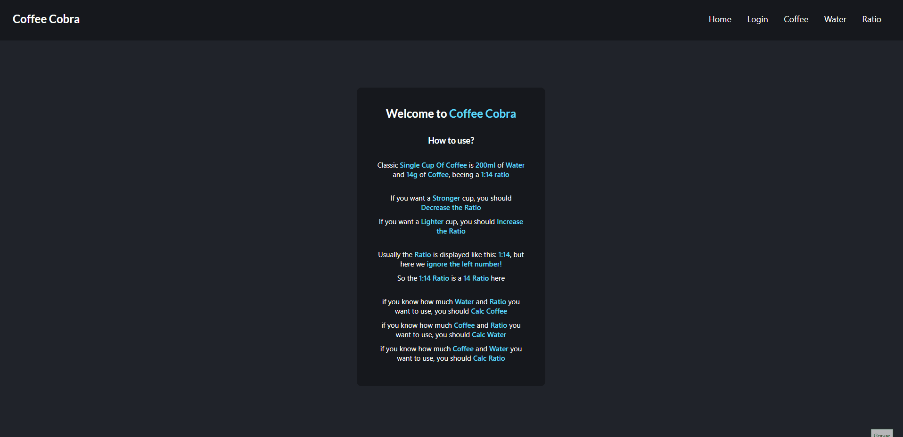

# README

Sistema de cálculo de café, criado com react, node, express e mongodb 

 
    <a href="#sobre">Sobre</a>
    <a href="#funcionalidades">Funcionalidades</a>
    <a href="#tecnologias">Tecnologias</a>
    <a href="#testar">Testar</a>
    <a href="#Autor">Autor</a>
     
 

 # Sobre
 

 
Sistema web para calcular ratio/formulas/receitas para café, utlizando para o front: React e React Semantic UI, e no back é utilizado express com node.js    
 No sistema o usúario pode calcular quanto de café, água ou ratio necessário para criar o seu café perfeito.    
 Existe também a possibilidade de cada usuário ter sua própria conta, salvando suas receitas favoritas, enviando requisição para o backend e assim salvando o mesmo dentro do Mongo DB.    
 Projeto com o foco em desenvolver um sistema com arquitetura REST, que utilize meus conhecimentos de frontend e backend e também resolver um problema que eu tenho de conseguir fazer a mesma receita de café em quantidades variadas.

 
Você pode usar a minha conta teste ou ate mesmo criar sua própria conta

    <ul>
        <li>Login: yutaro</li>
         <li>Senha: negi</li>
 </ul>

 
O site está 100% em inglês para treinar o meu desenvolvimento com projetos em inglês

 # Funcionalidades 
<ul>
    <li>Cadastro de usuário</li>
    <li>Login para acesso ao sistema</li>
    <li>Encriptação de senhas</li>
    <li>Adição de receitas</li>
    <li>Remoção de receitas</li>
    <li>Listagem de receitas</li>
    <li>Cálculo para receitas</li>
 </ul>

 # Tecnologias
 <ul>
    <li>React</li>
    <li>React Semantic UI</li>
    <li>Node.js</li>
    <li>Express</li>
    <li>MongoDB</li>
    <li>Javascript</li>
    <li>HTML</li>
    <li>CSS</li>
 </ul>

 
 # Como testar
 <ol>
    <li>É possivel testar projeto hospedado no <a href="https://coffee-cobra.herokuapp.com/">heroku</a></li>
    <li>Porém se quiser testar na sua máquina só seguir os próximos passos</li>
    <li>Abre o terminal de sua prefência</li>
    <li>git clone https://github.com/YutaroNegi/coffee-cobra.git</li>
    <li>cd coffee-cobra\</li>
    <li>npm i</li>
    <li>node index</li>
    <li>Abra o seu navegador e digite "http://localhost:5000"</li>
    <li>Pronto! só testar</li>
 </ol>

 # Autor

 <ul>
    <li>Yutaro Negi</li>
    <li><a href="https://www.linkedin.com/in/yutaronegi/">Linkedin</a></li>
    <li>(11) 94194-5061</li>
    <li>souza_yutaro@hotmail.com</li>
 </ul>

